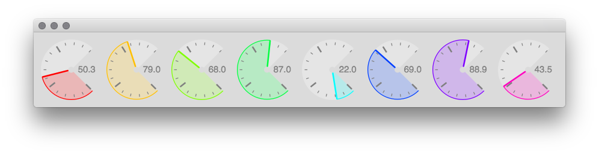
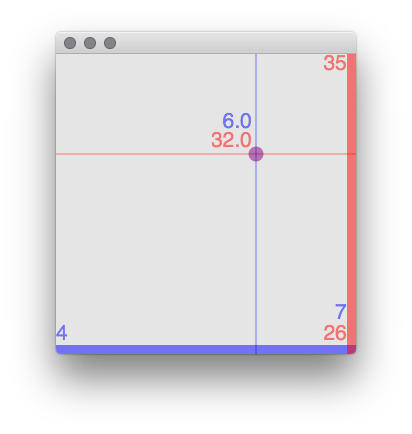

The ValueView Quark : Read Me
=============================
_A library of customizable views associated with one or more values for designing your own UI and/or for data visualization._

 A `ValueView` stores a value and will draw a representation of that value in whatever way you choose. Similarly, for a view that interacts with multiple values, there is `ValuesView`.
The Quark includes functional examples classes: `RotaryView`, a rotary encoder style widget (like a more flexible version of `Knob`), and `XYScaleView`, an X/Y plotter controller.

*RotaryView, an example of a widget made with ValueView.*

#### Highlights

The view:
- will automatically update when its values change
- will notify dependents of changed values
- can optionally be made interactive, so you can change its value through mouse/key/scroll interaction
- can limit its update rate and suppress repeated actions
- uses `ControlSpec`s internally for un/mapping values for easy setting of ranges and warp factors

#### Composing your own view

These classes aren't quite plug-and-play: `ValueView` is meant to be subclassed to author a new view/value representation. You'll also subclass `ValueViewLayer`s which define drawing layers with user-assignable properties. Drawing happens through Qt's `Pen` methods (used within a `UserView` internally).

There's a guide to get you up and running, `Guides>Subclassing ValueView`, as well as two fully functional classes to use and reference: `RotaryView` and `XYScaleView`.

*XYScaleView, a simple example of a widget made with ValuesView.*

Installing
==========

Install via SuperCollider's command line:

>`Quarks.install("https://github.com/mtmccrea/ValueView")`

Feedback and Bug Reports
------------------------

Known issues are logged at
[GitHub](https://github.com/mtmccrea/ValueView/issues).

Change log
----------

0.1.0
- Published as a Quark.

Credits
-------

The development of the ValueView Quark for SuperCollider3 is supported
by
[The University of Washington's Center for Digital Arts and Experimental Media (DXARTS)](https://dxarts.washington.edu/).
&nbsp;

Copyright the ATK Community, Joseph Anderson, and Michael McCrea, 2018.

Contributors
------------

*  Michael McCrea (@mtmccrea)
